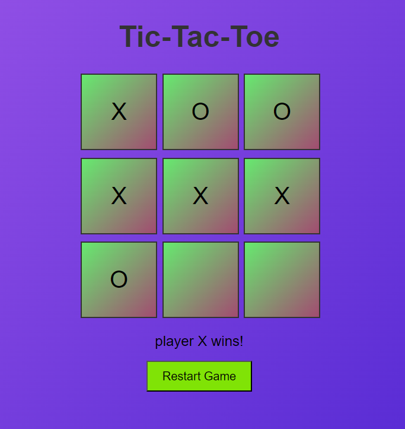

 🎯 Tic-Tac-Toe Game | PRODIGY_WD_03

An engaging and user-friendly Tic-Tac-Toe game crafted with HTML, CSS, and JavaScript.  
Challenge your friends and experience the excitement of the classic 3x3 board game with a modern touch!

✨ Key Features
- Two-player gameplay
- Animated winning line display
- Real-time winning and draw notifications
- Restart option to play multiple rounds

🛠️ Technologies Used
- HTML5 for structure
- CSS3 for design and responsiveness
- JavaScript for game logic and interactivity

📸 Project Screenshot

